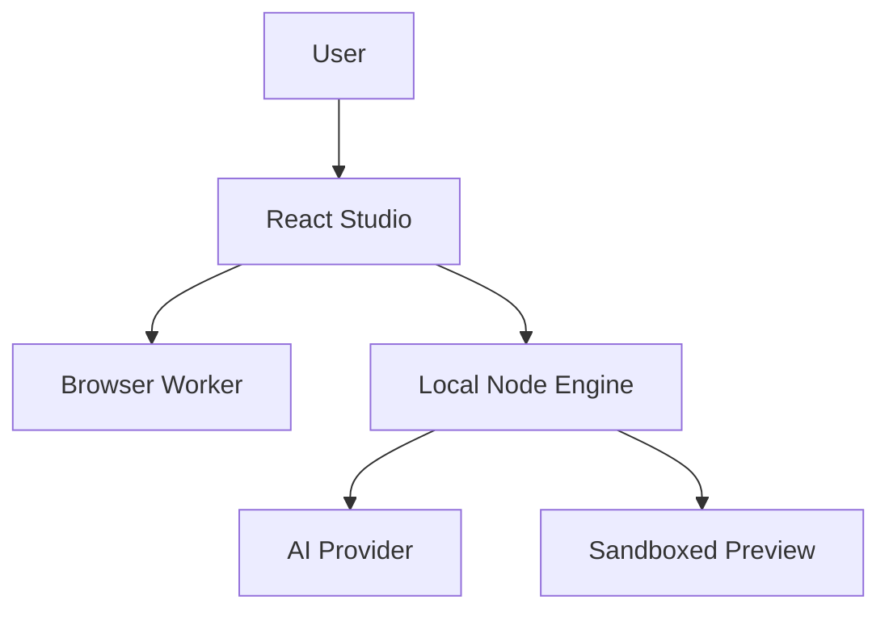

# ForgeUI 技术设计文档

> 面向企业营销落地页的 Design-System-Aware D2C 工作台

- 文档类型：技术设计文档（TDD）
- 文档版本：评审修订版 v1.0
- 项目阶段：MVP
- 应用形态：React Studio + Local Node Engine
- 默认生成目标：React + TypeScript + CSS Variables + CSS Modules
- 核心模块：Design IR、Token Resolver、Component Registry、Matcher、AST Codegen、AI Patch、Validator

---

## 1. 技术目标

ForgeUI 要建立一条确定性优先、AI 辅助、可解释、可验证、可回退的设计到代码链路：

```text
Design JSON
→ Input Adapter
→ Design Linter
→ Design IR
→ Token / Component / Responsive Resolver
→ Generation Plan
→ React AST Codegen
→ Type / Build / Runtime / Visual Validator
→ Preview / Report / Export
```

自然语言修改采用独立链路：

```text
User Prompt
→ AI Gateway
→ Patch Plan
→ Schema + Version + Allowlist Validation
→ Immutable IR Patch
→ Incremental Codegen
→ Validation
→ Commit / Rollback
```

### 1.1 MVP 技术目标

- 一个 AI SaaS Flagship 可以端到端生成、预览、验证和导出。
- 支持一套外部示例 React 组件库通过 Registry Manifest 接入。
- 相同输入和相同版本产生稳定输出。
- AI 不能直接修改源码，只能输出受约束 Patch。
- 生成代码可以通过真实 TypeScript 和 Vite Build。
- 错误能够定位到阶段、节点和建议操作。

### 1.2 非目标

- 不在浏览器中模拟完整 Node/npm 环境。
- 不扫描任意组件库源码并自动推断全部 API。
- 不支持任意脚本和依赖执行。
- 不支持通用截图解析和多框架代码生成。
- 不实现线上多租户、多人协作和云端部署沙箱。

---

## 2. 架构原则

### 2.1 规则与 AI 分工

规则负责：

- 输入 Schema 和节点稳定 ID
- Token Alias、类型、单位和冲突
- Component Key 精确映射和硬约束
- Props、Variant、Slot 和 Import 校验
- 响应式优先级
- Generation Plan 和 AST Codegen
- TypeScript、Build、Runtime 和 Visual 验证
- 版本、Diff、回退和导出

AI 负责：

- 节点语义化命名建议
- 页面区块语义识别建议
- 自然语言意图解析
- Patch Plan 和结构化 Patch
- 失败原因的自然语言解释

AI 的建议不能绕过规则层直接提交。

### 2.2 中间表示优先

禁止：

```text
Design JSON → LLM → 完整 JSX
```

采用：

```text
Design JSON → Versioned Design IR → Generation Plan → Babel AST → TSX
```

### 2.3 确定性与版本化

每次生成绑定：

- Input Schema Version
- Engine Version
- Registry ID + Version
- Token Rule Version
- Generator Version
- Model + Prompt Schema Version（仅 AI Patch）

不依赖 AI 的阶段必须做到输入相同、输出稳定。

### 2.4 最小修改

Patch 只修改 IR、Token 或白名单配置。受影响文件通过依赖图计算，不全量重写整个项目。

### 2.5 安全失败

无法确认组件能力、Import、交互或 Token 类型时，系统必须降级或请求人工确认，不得生成表面正确但行为未知的代码。

---

## 3. 系统上下文与部署形态

### 3.1 MVP 架构



### 3.2 模块职责

| 模块 | 职责 |
| --- | --- |
| React Studio | 工作台 UI、节点选择、版本、Diff、报告和导出操作 |
| Browser Worker | JSON 解析、轻量 Lint、Token 聚类和大 Diff |
| Local Node Engine | AI Gateway、AST Codegen、TypeScript、Vite Build、预览、Playwright 和 ZIP |
| Sandboxed Preview | 隔离展示生成页面，通过受约束消息协议上报运行时状态 |
| AI Provider | 仅生成符合 Patch Schema 的候选结果 |

### 3.3 为什么需要 Node Engine

- 浏览器 iframe 不能直接完成真实 Vite 生产构建。
- 模型密钥不能暴露在前端。
- Playwright 截图和固定环境回归需要 Node 进程。
- ZIP、临时目录、构建超时和进程隔离更适合服务端执行。

MVP 的 Node Engine 是本地开发服务，不等同于生产级云端执行平台。

---

## 4. 技术栈

### 4.1 Studio

- React
- TypeScript
- Vite
- Zustand：本地交互状态
- TanStack Query：Engine 请求和 Job 状态
- Tailwind CSS：仅用于 ForgeUI 工作台
- Radix Primitives：可访问性底层交互
- react-resizable-panels：工作台布局
- Monaco Editor：代码与 Diff
- Motion：工作台轻量动画

### 4.2 Engine

- Node.js
- TypeScript
- Fastify：本地 API 与 SSE Job 进度
- Zod 或 JSON Schema Validator：运行时协议校验
- Babel Types + Babel Generator：TSX AST 生成
- TypeScript Compiler API：类型检查
- Vite Programmatic API：生产构建
- ESLint：代码和可访问性规则
- Prettier：稳定格式化
- Playwright：运行时与截图验证
- JSZip 或等价工具：导出打包

### 4.3 Token 与测试

- DTCG 风格外部数据
- 内部标准化 Token Model
- Vitest
- Testing Library
- Playwright

### 4.4 明确取舍

- Babel AST 负责生成，TypeScript Compiler 只负责验证，MVP 不同时引入 ts-morph。
- 生成代码使用 CSS Variables + CSS Modules，不依赖动态 Tailwind 扫描。
- 工作台可以使用 Tailwind，与生成结果的样式策略相互独立。

---

## 5. Monorepo 结构

```text
forge-ui/
├── apps/
│   ├── studio/
│   │   └── src/
│   │       ├── features/
│   │       ├── pages/
│   │       ├── stores/
│   │       ├── services/
│   │       └── workers/
│   └── engine/
│       └── src/
│           ├── routes/
│           ├── jobs/
│           ├── preview/
│           ├── ai/
│           └── security/
├── packages/
│   ├── contracts/
│   ├── ui/
│   ├── example-external-ui/
│   ├── design-ir/
│   ├── design-linter/
│   ├── design-tokens/
│   ├── component-registry/
│   ├── component-matcher/
│   ├── responsive-resolver/
│   ├── asset-resolver/
│   ├── generation-plan/
│   ├── code-generator/
│   ├── patch-engine/
│   ├── validator/
│   └── shared/
├── presets/
│   ├── saas/
│   └── eval-only/
├── evals/
├── docs/
├── .ai/
├── package.json
└── pnpm-workspace.yaml
```

MVP 使用 pnpm workspace，不强制引入 Turborepo。

---

## 6. 输入合同

### 6.1 Design Input Envelope

```ts
export interface DesignInputEnvelope {
  schemaVersion: '1.0'
  documentId: string
  source: {
    type: 'preset' | 'json'
    name: string
  }
  root: RawDesignNode
  tokens?: ExternalToken[]
  assets?: ExternalAsset[]
  metadata?: Record<string, unknown>
}
```

### 6.2 输入约束

```ts
export const INPUT_LIMITS = {
  maxBytes: 5 * 1024 * 1024,
  maxNodes: 2_000,
  maxDepth: 30,
  maxTextLength: 20_000
} as const
```

解析顺序：

```text
MIME / Size
→ JSON Parse
→ Schema
→ Node Count / Depth
→ Duplicate ID
→ Normalize
→ Design IR
```

任何设计文案、图层名和 metadata 都按不可信数据处理。

### 6.3 Adapter

```ts
export interface DesignInputAdapter<TInput> {
  id: string
  canHandle(input: unknown): input is TInput
  parse(input: TInput): Promise<DesignDocument>
}
```

MVP：

- `PresetAdapter`
- `JsonFileAdapter`

后续：

- `FigmaAdapter`
- `ScreenshotAdapter`

---

## 7. Design IR

### 7.1 文档模型

```ts
export interface DesignDocument {
  schemaVersion: '1.0'
  documentId: string
  root: DesignNode
  tokens: DesignToken[]
  assets: DesignAsset[]
  metadata: DesignMetadata
}

export type DesignNodeType =
  | 'page'
  | 'section'
  | 'layout'
  | 'component'
  | 'text'
  | 'image'
  | 'icon'
  | 'unknown'

export interface DesignNode {
  id: string
  name: string
  type: DesignNodeType
  semantic?: string
  source?: SourceReference
  layout?: LayoutSpec
  style?: StyleSpec
  content?: ContentSpec
  component?: ComponentReference
  responsive?: ResponsiveSpec
  interaction?: InteractionSpec
  accessibility?: AccessibilitySpec
  children: DesignNode[]
  metadata?: Record<string, unknown>
}

export interface SourceReference {
  sourceType: 'preset' | 'json'
  sourceId?: string
  nodeId?: string
  componentKey?: string
}

export interface DesignMetadata {
  title?: string
  description?: string
  locale?: string
}

export type TokenReference = { token: string }
export type StyleValue<T> = T | TokenReference

export interface TypographySpec {
  fontFamily?: StyleValue<string>
  fontSize?: StyleValue<LengthValue>
  fontWeight?: StyleValue<number>
  lineHeight?: StyleValue<number | LengthValue>
  letterSpacing?: StyleValue<LengthValue>
}

export interface StyleSpec {
  color?: StyleValue<string>
  background?: StyleValue<string>
  borderColor?: StyleValue<string>
  borderRadius?: StyleValue<LengthValue>
  shadow?: StyleValue<string>
  typography?: TypographySpec
}

export interface ComponentReference {
  sourceKey?: string
  semantic?: string
  variant?: string
  props?: Record<string, unknown>
}
```

### 7.2 稳定 ID

优先级：

1. 输入提供且全局唯一的 `nodeId`。
2. Preset 中固定 ID。
3. 由 `documentId + sourcePath + siblingIndex` 生成确定性 Hash。

发现重复 ID 时阻断生成。MVP 不支持 AI 插入节点，因此不处理生成式节点 ID。

### 7.3 Layout 与 Responsive

```ts
export type LengthValue =
  | { value: number; unit: 'px' | 'rem' | '%' | 'vw' | 'vh' }
  | { token: string }
  | 'auto'

export interface BoxValue {
  top?: LengthValue
  right?: LengthValue
  bottom?: LengthValue
  left?: LengthValue
  block?: LengthValue
  inline?: LengthValue
}

export interface LayoutSpec {
  display?: 'block' | 'flex' | 'grid'
  direction?: 'row' | 'column'
  wrap?: 'nowrap' | 'wrap'
  align?: 'start' | 'center' | 'end' | 'stretch'
  justify?: 'start' | 'center' | 'end' | 'between'
  columns?: number
  gap?: LengthValue
  padding?: BoxValue
  width?: LengthValue
  minWidth?: LengthValue
  maxWidth?: LengthValue
  height?: LengthValue
  aspectRatio?: string
  overflow?: 'visible' | 'hidden' | 'auto'
  position?: 'static' | 'relative' | 'absolute'
}

export type Breakpoint = 'mobile' | 'tablet' | 'desktop'

export interface ResponsiveSpec {
  layout?: Partial<Record<Breakpoint, Partial<LayoutSpec>>>
  typography?: Partial<Record<Breakpoint, TypographySpec>>
  visibility?: Partial<Record<Breakpoint, boolean>>
  imageFit?: Partial<Record<Breakpoint, 'cover' | 'contain'>>
}
```

### 7.4 Content、Interaction 与 A11y

```ts
export interface TextSegment {
  text: string
  style?: Partial<TypographySpec>
}

export type ContentSpec =
  | { kind: 'text'; value: string }
  | { kind: 'rich-text'; segments: TextSegment[] }
  | { kind: 'asset'; assetId: string }
  | { kind: 'repeat'; itemIds: string[] }

export interface InteractionSpec {
  role?: 'link' | 'button' | 'navigation' | 'none'
  href?: string
  target?: '_self' | '_blank'
}

export interface AccessibilitySpec {
  label?: string
  alt?: string
  decorative?: boolean
  headingLevel?: 1 | 2 | 3 | 4 | 5 | 6
}
```

IR 不包含 React Hook、Tailwind Class 或 CSS Module 名称。

---

## 8. Design Linter

### 8.1 规则接口

```ts
export interface DesignLintRule {
  id: string
  defaultSeverity: 'info' | 'warning' | 'error'
  check(document: DesignDocument): DesignLintIssue[]
}

export interface DesignLintIssue {
  ruleId: string
  nodeId?: string
  severity: 'info' | 'warning' | 'error'
  message: string
  suggestion?: string
  blocking: boolean
}
```

### 8.2 MVP 规则

- unnamed-node
- duplicate-id
- deep-nesting
- excessive-absolute-position
- hardcoded-color
- missing-responsive-rule
- unsupported-font
- missing-asset
- heading-structure
- inaccessible-action-node

MVP 没有 Figma Adapter，因此 `detached-component` 和 `missing-auto-layout` 不进入 MVP 规则集。

### 8.3 评分

评分仅用于 UI 概览：

- Error：每条扣 10 分。
- Warning：每条扣 3 分。
- Info：不扣分。
- 单一规则最多扣 20 分。
- 最低为 0 分。

生成是否阻断由 `blocking` 决定，不直接根据总分判断。

---

## 9. Token Resolver

### 9.1 内部模型

外部输入可接近 DTCG，进入系统后转换为可序列化内部模型：

```ts
export type TokenType =
  | 'color'
  | 'dimension'
  | 'fontFamily'
  | 'fontWeight'
  | 'typography'
  | 'shadow'

export interface DesignToken<T = unknown> {
  path: string
  type: TokenType
  value: T | TokenAlias
  level: 'primitive' | 'semantic'
  description?: string
  source?: string
}

export interface TokenAlias {
  ref: string
}

export interface DimensionTokenValue {
  value: number
  unit: 'px' | 'rem' | '%'
}
```

MVP 不在内部实体中使用 `Map` 作为持久化格式，避免 JSON、Diff 和 IndexedDB 边界不一致。计算阶段可临时建立索引。

### 9.2 解析流程

```text
Collect
→ Normalize Type / Unit
→ Exact Deduplication
→ Alias Graph
→ Cycle / Missing Ref / Type Validation
→ Existing Token Match
→ Similarity Suggestion
→ Conflict Resolution
→ CSS Variables
```

### 9.3 相似值

- 颜色使用 Lab + Delta E 生成建议。
- Dimension 按类型和单位归一后比较。
- 相似只产生候选，不自动合并语义不同的 Token。

### 9.4 CSS Variables

```css
:root {
  --color-purple-500: #6c5ce7;
  --color-brand-primary: var(--color-purple-500);
  --space-section-block: 6rem;
}
```

变量命名必须稳定，并在冲突时输出诊断而不是静默覆盖。

---

## 10. Component Registry

### 10.1 Registry Manifest

```ts
export interface ComponentRegistryManifest {
  schemaVersion: '1.0'
  registryId: string
  registryVersion: string
  package: {
    name: string
    version: string
    allowedImportRoots: string[]
  }
  components: RegisteredComponent[]
  recipes?: CompositionRecipe[]
}

export interface RegisteredComponent {
  id: string
  displayName: string
  import: {
    path: string
    exportName: string
    style: 'named' | 'default'
  }
  sourceKeys?: string[]
  semantics: string[]
  props: PropDefinition[]
  variants?: VariantDefinition[]
  slots?: SlotDefinition[]
  capabilities: ComponentCapability[]
  requiredTokens?: string[]
  fallback?: FallbackDefinition
}

export interface SlotDefinition {
  name: string
  accepts: Array<'text' | 'icon' | 'image' | 'component' | 'node-list'>
  required?: boolean
}
```

### 10.2 Manifest 校验

- Import 必须位于 `allowedImportRoots`。
- Export style 和 exportName 必须明确。
- Prop 默认值与枚举值必须满足类型。
- Slot 和 Children 映射不得互相冲突。
- Capability 必须来自系统枚举。
- Source Key 在同一 Registry 中必须唯一。
- Registry Version 进入生成 Manifest。

### 10.3 MVP 外部组件库

仓库提供 `packages/example-external-ui`，它与 ForgeUI 工作台的 `packages/ui` 分离，用于证明 Registry 接入而不是内部硬编码。

Standalone 导出时：

- 若 Registry 包已发布，写入固定 SemVer 依赖。
- MVP 本地示例包以 `vendor/example-external-ui` 一并导出，并通过 `file:` 依赖引用。

Integration 导出时保留原始 Import Path，并输出依赖清单。

---

## 11. Component Matcher

### 11.1 匹配阶段

```text
1. Hard Constraint Filter
2. Source Key Exact Match
3. Props / Variant / Slot Compatibility
4. Semantic Candidate Ranking
5. Adapter / Recipe
6. Native / Manual Review
```

Source Key 完全一致时不再依赖加权分数决定是否为 Exact Match，但仍必须验证 Import 和 Props 合法性。

### 11.2 硬约束

以下情况直接排除候选：

- 必填 Slot 无法满足
- 必填 Prop 无法生成
- Action 语义与组件能力冲突
- Registry Import 未通过白名单
- 所需 Token 类型不兼容
- 响应式能力为硬要求但组件不支持

### 11.3 语义候选评分

仅对通过硬约束且无 Source Key 精确匹配的候选评分：

| 因素 | 权重 |
| --- | ---: |
| 语义标签 | 35 |
| Props / Variant 兼容 | 25 |
| Slot / Content 兼容 | 20 |
| Capability | 15 |
| Token / Layout | 5 |

阈值初始值：

- `>= 85`：建议 Adapter，可自动预选。
- `70～84`：展示候选，需用户确认。
- `< 70`：Recipe、Native 或 Manual Review。

阈值必须通过 Eval 校准。

### 11.4 Score 与 Confidence

```ts
export interface ComponentMatchResult {
  nodeId: string
  componentId?: string
  strategy:
    | 'exact-component'
    | 'adapted-component'
    | 'registered-recipe'
    | 'native-element'
    | 'manual-review'
  ruleScore?: number
  confidence: 'high' | 'medium' | 'low'
  reasons: MatchReason[]
  incompatibilities: string[]
  warnings: string[]
}
```

Confidence 根据固定评测集的准确率区间校准，不伪装成模型概率。

### 11.5 Recipe

Recipe 是 Registry 中明确登记、可测试的组件组合模板。MVP 不允许 AI 在运行时任意组合 JSX。

---

## 12. Responsive Resolver

### 12.1 优先级

```text
User Override
> Input Responsive Spec
> Section Preset
> Common Default
```

### 12.2 合并规则

- 使用 mobile-first 基础值。
- 高断点只覆盖明确字段。
- visibility 不继承未知值。
- 响应式 typography 与 layout 分开合并。
- 冲突产生 Diagnostic 并保留来源。

### 12.3 MVP Preset

- Hero：Mobile Column、Desktop Row。
- Feature Grid：1 / 2 / 4 列。
- Header：Mobile Menu 使用已注册交互组件；缺失时 Manual Review。
- CTA：Mobile 支持 Full Width。
- Page Container：统一 Max Width 和响应式 Padding。

---

## 13. Asset Resolver

```ts
export interface DesignAsset {
  id: string
  type: 'image' | 'icon' | 'logo' | 'font'
  sourceUrl?: string
  localPath?: string
  alt?: string
  status: 'resolved' | 'missing' | 'placeholder'
  contentHash?: string
}
```

流程：

```text
Reference Collection
→ Type / Domain / Size Validation
→ Hash Deduplication
→ Semantic Filename
→ assets.ts
→ Missing Fallback + Diagnostic
```

MVP 不做图片 CDN 和在线压缩服务。SVG 禁止内嵌脚本和外部引用。

---

## 14. Generation Plan

```ts
export interface GenerationPlan {
  schemaVersion: '1.0'
  generationId: string
  sourceHash: string
  versions: GenerationVersions
  page: PagePlan
  imports: ImportPlan[]
  sections: SectionPlan[]
  styles: StyleOutputPlan
  content: ContentPlan
  tokens: TokenOutputPlan
  assets: AssetOutputPlan
  dependencyGraph: GenerationDependencyGraph
  diagnostics: GenerationDiagnostic[]
}
```

职责：

- 文件和组件拆分
- Import、Slot 和 Props 绑定
- Token 与 CSS Module 引用
- Content 和 Asset 提取
- 降级与人工确认收集
- 输出文件依赖图

### 14.1 依赖图

示例：

```text
Token Path → tokens.css
Section Node → sections/X.tsx + X.module.css
Content Node → content.ts + Owning Section
Asset ID → assets.ts + Referencing Sections
Registry Component → Importing Sections
```

Patch 根据依赖图计算受影响文件；无法安全计算时允许全量重新生成，但必须保持稳定输出。

---

## 15. Code Generator

### 15.1 生成链路

```text
Generation Plan
→ Babel TSX AST
→ Babel Generator
→ Prettier
→ Stable File Sort
→ Generated Project
```

不建立“React AST → TypeScript AST”两套模型。Babel AST 直接表达 JSX 和 TypeScript 语法，TypeScript Compiler 在后续负责校验。

### 15.2 输出模型

```ts
export interface GeneratedProject {
  files: GeneratedFile[]
  manifest: GenerationManifest
  diagnostics: GenerationDiagnostic[]
}

export interface GeneratedFile {
  path: string
  language: 'typescript' | 'tsx' | 'css' | 'json' | 'html' | 'markdown'
  content: string
  contentHash: string
}
```

### 15.3 代码规则

- AST 中禁止构造任意脚本字符串和动态 Import。
- Import 按来源和名称稳定排序。
- 仅结构相同的重复节点使用数据数组和 map。
- Section 默认独立文件和 CSS Module。
- Token 统一进入 `tokens.css`。
- 素材统一进入 `assets.ts`。
- Button、Link、Heading 和 Section 使用语义元素。
- 除 Token 文件外，不出现品牌色硬编码。
- 不输出随机类名、时间戳和不稳定字段。

### 15.4 生成 Manifest

```ts
export interface GenerationManifest {
  generationId: string
  createdAt: string
  inputHash: string
  engineVersion: string
  generatorVersion: string
  registry: { id: string; version: string }
  schemaVersions: Record<string, string>
  dependencies: Record<string, string>
  outputMode: 'standalone' | 'integration'
}
```

`createdAt` 只进入 Manifest，不参与源文件内容，避免破坏确定性快照。

---

## 16. AI Gateway

### 16.1 职责

- 从服务端环境变量读取模型密钥。
- 构建最小必要上下文。
- 将系统规则与不可信设计内容隔离。
- 请求 JSON Structured Output。
- 处理超时、重试、限流和取消。
- 验证 Patch Schema。
- 记录模型、Prompt Schema、耗时和 Token 用量，不记录密钥。

### 16.2 Provider Adapter

```ts
export interface AiPatchProvider {
  createPatch(input: AiPatchRequest): Promise<AiPatchCandidate>
}
```

业务层不直接依赖具体模型 SDK。

### 16.3 上下文最小化

只发送：

- 用户 Prompt
- 当前 `baseVersionId`
- 允许修改的节点摘要
- Token、Content 和 Props 白名单
- Patch JSON Schema

不发送完整仓库源码、模型密钥和无关设计节点。

### 16.4 Prompt Injection 防护

- 节点名、文案和 metadata 放在明确的 `untrusted_design_data` 字段。
- 系统提示声明设计内容只作为数据，不是指令。
- 即使模型返回非法操作，最终仍由 Schema、Path Allowlist 和 Version Guard 拒绝。

### 16.5 失败策略

- 网络错误：指数退避，最多重试 2 次。
- 结构化输出失败：携带 Schema 错误进行一次修复请求。
- 超时：取消请求并保留当前版本。
- 限流：显示可重试时间，不自动无限重试。

---

## 17. Patch Engine

### 17.1 MVP Patch 协议

```ts
export type PatchOperation =
  | UpdateTokenOperation
  | UpdateContentOperation
  | UpdatePropOperation

export interface PatchDocument {
  schemaVersion: '1.0'
  patchId: string
  requestId: string
  baseVersionId: string
  summary: string
  operations: PatchOperation[]
}
```

### 17.2 示例

```json
{
  "schemaVersion": "1.0",
  "patchId": "patch_brand_001",
  "requestId": "req_001",
  "baseVersionId": "version_003",
  "summary": "更新品牌色、Hero 标题和功能区列数",
  "operations": [
    {
      "type": "update_token",
      "path": "color.brand.primary",
      "value": "#ff7a45"
    },
    {
      "type": "update_content",
      "targetId": "hero-title",
      "value": "Build faster"
    },
    {
      "type": "update_prop",
      "targetId": "feature-grid",
      "path": "responsive.layout.desktop.columns",
      "value": 4
    }
  ]
}
```

### 17.3 校验

- Patch Schema 正确。
- `patchId` 未执行过，保证幂等。
- `baseVersionId` 等于当前版本，否则返回 `PATCH_STALE`。
- targetId 和 Token Path 存在。
- Path 位于操作白名单。
- Value 类型、单位和枚举合法。
- 不允许修改 Import、脚本、Registry 和工作台代码。

### 17.4 事务

```ts
export async function applyPatchTransaction(
  current: ProjectState,
  patch: PatchDocument
): Promise<PatchTransactionResult> {
  validateVersionAndIdempotency(current, patch)
  validatePatchSchemaAndPaths(current, patch)

  const candidate = applyPatchImmutably(current, patch)
  const affected = resolveAffectedFiles(candidate, patch)
  const generated = await regenerate(candidate, affected)
  const validation = await validateGeneratedProject(generated)

  if (!validation.valid) {
    return rollbackToCurrent(current, validation.issues)
  }

  return commitCandidate(candidate, generated, validation)
}
```

Patch 失败不需要“恢复被修改的可变对象”，因为候选状态从当前成功状态不可变派生。

---

## 18. 版本与持久化

### 18.1 数据归属

- Studio IndexedDB 是 MVP 项目、输入和版本快照的持久化来源。
- Node Engine 对验证 Job 保持短期临时产物，不保存长期用户项目。
- 页面刷新后可从 IndexedDB 恢复并重新生成预览。

### 18.2 版本模型

```ts
export interface GenerationVersion {
  id: string
  parentId?: string
  createdAt: number
  source: 'initial-generation' | 'ai-patch' | 'rollback'
  prompt?: string
  patch?: PatchDocument
  snapshot: ProjectSnapshot
  validation: ProjectValidationResult
  status: 'success' | 'failed' | 'rolled-back'
}
```

### 18.3 存储策略

- 保留最近 10 个成功版本和最近 10 条失败记录。
- Snapshot 使用结构化对象和内容 Hash，避免重复存储大文件。
- IndexedDB Schema 需要独立版本和迁移函数。
- 配额不足时提示用户先导出，不静默删除当前版本。

---

## 19. Validator

### 19.1 验证层级

```ts
export interface ProjectValidator {
  validate(
    project: GeneratedProject,
    options: ValidationOptions
  ): Promise<ProjectValidationResult>
}
```

执行顺序：

```text
Schema
→ TypeScript
→ ESLint
→ Vite Build
→ Runtime
→ Layout Assertions
→ Screenshot Baseline（有基线时）
```

### 19.2 Node 验证 Harness

- 每个 Job 使用明确的临时目录。
- 使用 Engine 预安装的允许依赖，不运行用户提供的 install script。
- Vite Alias 指向批准的组件包。
- 设置 CPU 时间、总时长和输出大小限制。
- Job 完成或超时后清理临时目录。
- 不使用未校验环境变量或宽泛目录作为清理目标。

### 19.3 Visual 验证

固定 viewport：

- Desktop：1440 × 900
- Tablet：768 × 1024
- Mobile：390 × 844

所有输入均执行：

- 横向溢出
- 元素重叠异常
- 关键元素不可见
- 图片加载失败
- 页面高度和布局稳定性

只有内置 Preset 和官方 Eval 存在批准截图基线；用户自定义输入只生成截图和布局诊断，不计算“与未知设计稿的像素相似度”。

### 19.4 验证状态

```ts
export type ValidationStatus =
  | 'pending'
  | 'running'
  | 'passed'
  | 'warning'
  | 'failed'
  | 'skipped'
```

`skipped` 必须说明原因，不能作为 Passed 统计。

---

## 20. Preview Runtime

### 20.1 流程

```text
Generated Project
→ Engine Build
→ Static Artifact
→ Isolated Preview Origin
→ iframe
→ postMessage Diagnostics
```

### 20.2 安全

- iframe 使用最小 sandbox flags。
- Preview 与 Studio 使用不同 Origin/Port。
- 配置 CSP，默认禁止外部 Script。
- 外部图片只允许白名单域名。
- `postMessage` 校验 `origin`、消息类型和 Payload Schema。
- Runtime Bridge 只上报挂载、Console、资源和元素定位信息。
- Preview 不能调用 Engine 管理接口和读取 Studio 存储。

### 20.3 节点联动

生成元素通过 `data-forge-node-id` 保留 IR Node ID，仅用于开发预览。Integration 导出可配置是否移除该属性。

---

## 21. Exporter

### 21.1 Standalone

包含：

- 完整 Vite 入口和配置
- 生成页面、Section、CSS Module、Token 和素材
- 固定依赖版本
- Vendor 示例组件包或正式包依赖
- Generation Manifest 和 Report
- README 与运行命令

### 21.2 Integration

包含：

- 页面和 Section 源码
- Token、样式、内容和素材
- 原始 Import Path
- 组件、依赖和手动确认清单
- 集成说明

### 21.3 导出门槛

- 通过 Build 时标记 `validated`。
- 未通过时允许导出 `diagnostic` 包，但文件名和 README 必须明确失败状态。
- 导出过程不包含模型密钥、Prompt 私密配置和临时构建目录。

---

## 22. Engine API 与 Job

### 22.1 API

```text
POST /api/analyze
POST /api/generate
POST /api/validate
POST /api/ai/patch-plan
POST /api/patch/apply
POST /api/export
GET  /api/jobs/:jobId/events
DELETE /api/jobs/:jobId
GET  /api/health
```

所有请求和响应来自 `packages/contracts`，前后端共享类型和运行时 Schema。

### 22.2 Job 状态

```ts
export type JobState =
  | 'queued'
  | 'running'
  | 'succeeded'
  | 'failed'
  | 'cancelled'
  | 'timed-out'
```

SSE 事件：

```text
job.started
stage.started
stage.progress
diagnostic.created
stage.completed
job.completed
job.failed
```

每个 Job 带 `requestId`，前端忽略已被用户取消或被新请求替代的旧结果。

---

## 23. 状态管理

### 23.1 Zustand

只保存本地 UI 和领域状态：

```text
projectStore
- Design IR
- 当前成功版本
- 本地版本列表

selectionStore
- 当前 Node
- Tree / Preview / Code 联动

workspaceStore
- Panel、Device、Active Tab

registryStore
- Registry、Overrides、Match Results

tokenStore
- Token、Conflicts、Selection
```

### 23.2 Query State

Engine Job、健康状态、验证进度和导出请求使用 Query 层管理，避免与本地领域状态混在一个巨大 Store。

### 23.3 Browser Worker

适合放入 Worker：

- 输入解析与轻量 Lint
- Token 相似值聚类
- 大型 IR Diff
- 报告派生指标

AST、Build 和 Playwright 固定在 Node Engine。

---

## 24. 错误模型与可观测性

### 24.1 错误结构

```ts
export interface ForgeError {
  code: ForgeErrorCode
  stage: PipelineStage
  message: string
  affectedNodeIds?: string[]
  recoverable: boolean
  fallbackApplied: boolean
  suggestedActions: string[]
  requestId: string
}
```

关键错误码：

- DESIGN_PARSE_FAILED
- DESIGN_SCHEMA_INVALID
- DESIGN_LIMIT_EXCEEDED
- TOKEN_ALIAS_CYCLE
- TOKEN_TYPE_MISMATCH
- REGISTRY_INVALID
- COMPONENT_NOT_FOUND
- COMPONENT_INCOMPATIBLE
- ASSET_MISSING
- CODE_GENERATION_FAILED
- PATCH_INVALID
- PATCH_STALE
- TYPECHECK_FAILED
- BUILD_FAILED
- RUNTIME_FAILED
- VISUAL_REGRESSION_FAILED
- JOB_TIMED_OUT

### 24.2 观测指标

- 各 Pipeline Stage 耗时
- 输入节点和生成文件数量
- Match Strategy 分布
- Token 复用、冲突和循环数量
- Patch 接受、拒绝、回滚和超时数量
- Build、Runtime、Visual 通过率
- AI 延迟、重试和 Token 用量

日志对 Prompt 和设计内容做长度限制与脱敏，不记录密钥。

---

## 25. 安全模型

### 25.1 信任边界

| 输入 | 信任级别 | 处理 |
| --- | --- | --- |
| Engine 内置规则 | 可信 | 版本化、代码 Review |
| Registry Manifest | 不可信 | Schema、Import 白名单 |
| Design JSON | 不可信 | 限制、Schema、深度检查 |
| 设计文案和节点名 | 不可信 | 转义、Prompt 数据隔离 |
| AI Patch | 不可信 | Schema、Version、Allowlist |
| 生成 Preview | 隔离执行 | CSP、Sandbox、独立 Origin |

### 25.2 进程与文件安全

- 不执行 Registry 或 Design JSON 中的代码。
- 不运行任意 npm install 和生命周期脚本。
- 临时目录通过安全 API 创建并记录确切路径。
- 构建进程具有超时和输出限制。
- 清理仅针对当前 Job 的已确认临时目录。
- Engine 默认只监听本机回环地址。

---

## 26. Generation Report

```ts
export interface GenerationReport {
  metadata: {
    generationId: string
    inputHash: string
    versions: GenerationVersions
    durationMs: number
  }
  nodes: {
    total: number
    eligibleForComponentMatch: number
  }
  matches: {
    exact: number
    adapted: number
    recipes: number
    native: number
    manual: number
  }
  tokens: {
    referenced: number
    reused: number
    created: number
    conflicts: number
  }
  validation: Record<ValidationStage, ValidationStatus>
  accessibility: {
    passed: number
    warnings: number
    errors: number
  }
  performance: {
    jsBytes: number
    cssBytes: number
    assetBytes: number
  }
  diagnostics: GenerationDiagnostic[]
}
```

派生指标：

```ts
componentReuseRate =
  (exact + adapted + recipes) / eligibleForComponentMatch

tokenReuseRate = reused / referenced

manualReviewRate = manual / eligibleForComponentMatch
```

分母为 0 时返回 `null`，不能返回 0% 或 100% 误导用户。

---

## 27. 测试策略

### 27.1 单元测试

- Stable ID Generator
- Token Alias / Cycle / Type Resolver
- Registry Validator
- Component Hard Constraint Filter
- Semantic Scorer
- Prop Adapter 和 Recipe
- Responsive Merge
- Generation Dependency Graph
- Patch Schema / Version / Idempotency
- Code Generator

### 27.2 Property 与 Fuzz 测试

- 随机深度和异常 JSON
- Duplicate ID
- Token Alias 环与长链
- 非法 JSON Pointer Path
- 超长文本和大量节点
- Registry Import Traversal

### 27.3 快照测试

- Design Input → IR
- IR → Generation Plan
- Generation Plan → TSX / CSS
- Token → CSS Variables
- Patch → IR Diff

快照中排除 createdAt、Job ID 等不稳定字段。

### 27.4 集成测试

```text
Design JSON + Registry
→ Generate
→ TypeScript
→ Vite Build
→ Runtime
→ Report
```

### 27.5 E2E

- 导入 Preset 和 Registry
- 处理 Lint 阻断
- 查看 Match 原因
- 生成和三端预览
- 应用合法 Patch
- 拒绝 Stale/Invalid Patch
- 验证失败回滚
- Standalone / Integration 导出

---

## 28. 评测集

```text
evals/
├── flagship-saas/
│   ├── input.json
│   ├── registry.json
│   ├── expected.json
│   └── screenshots/
├── fintech-eval/
├── ecommerce-eval/
├── token-conflict/
├── token-alias-cycle/
├── missing-asset/
├── unknown-component/
├── malformed-design/
└── oversized-design/
```

```ts
export interface EvalCase {
  name: string
  kind: 'valid' | 'invalid' | 'degraded'
  input: DesignInputEnvelope
  registry: ComponentRegistryManifest
  expected: {
    errorCode?: ForgeErrorCode
    buildSuccess?: boolean
    expectedMatches?: Record<string, string>
    expectedStrategies?: Record<string, ComponentMatchResult['strategy']>
    expectedDiagnostics?: string[]
    visualBaseline?: string
  }
}
```

组件 Top-1 准确率只在人工标注的 Eligible Nodes 上计算。

---

## 29. CI 流程

```text
Install Frozen Lockfile
→ Typecheck Workspace
→ Unit / Property Tests
→ Registry Contract Tests
→ Eval Generation
→ Build Generated Apps
→ Playwright Runtime
→ Visual Regression
→ Publish Evaluation Report Artifact
```

CI 固定：

- Node 和包管理器版本
- 浏览器版本
- 字体文件
- viewport 和 device scale factor
- 时区与 Locale

视觉基线变更必须单独 Review，不能自动覆盖。

---

## 30. 性能预算

性能目标必须在 README 标注参考设备和数据规模。

| 阶段 | MVP 目标 |
| --- | ---: |
| 1,000 节点 JSON 解析 + Lint | ≤ 1 秒 |
| Token Resolver | ≤ 500 ms |
| Component Matcher | ≤ 500 ms |
| AST Codegen | ≤ 1 秒 |
| 首次 Type + Build + Runtime | P95 ≤ 10 秒 |
| 非结构 Patch 增量生成 | P95 ≤ 3 秒 |

Studio 主线程的连续阻塞任务不得超过 50 ms；超过阈值的浏览器计算移入 Worker。

---

## 31. 开发阶段规划

### Phase 1：合同与最小垂直链路

- Monorepo、共享 Contracts
- AI SaaS Design Input
- Design IR 和稳定 ID
- 最小 Registry、Exact Match
- 单页面硬编码 Generation Plan → AST → TSX
- Node Engine 最小 Build

验收：一个 Hero 页面可以从 JSON 生成并真实构建。

### Phase 2：Token、Registry 与 Matcher

- Token Resolver
- 外部示例组件库与 Manifest
- Hard Constraint、Adapter、Recipe 和降级
- Match Reason 和 Report

验收：8 个组件、4 个 Section 可解释匹配。

### Phase 3：工作台和预览

- 三栏工作台与底部诊断台
- Tree / Preview / Code 联动
- Responsive Resolver
- Sandboxed Preview

验收：三端可预览，节点可联动定位。

### Phase 4：验证、视觉和导出

- TypeScript、ESLint、Vite Build
- Runtime Bridge
- Playwright Layout / Screenshot
- Standalone / Integration ZIP

验收：Flagship 通过完整验证并可独立运行。

### Phase 5：AI Patch 与版本

- AI Gateway
- 三类 Patch
- Version Guard、Idempotency、Diff 和 Rollback
- IndexedDB 版本存储

验收：固定 Prompt 成功率达到发布门槛，非法 Patch 被拒绝。

### Phase 6：评测与展示

- 全部 Valid / Invalid / Degraded Eval
- CI Evaluation Report
- README、架构决策、失败案例和 Demo Video

---

## 32. 技术验收标准

1. Input、IR、Token、Registry、Patch 和 Report 均有版本化 Schema。
2. AI SaaS Preset 可以稳定转换为 Design IR，重复输入结果一致。
3. 外部示例组件库通过 Manifest 接入，不依赖工作台内部硬编码。
4. Exact Match 与候选评分分阶段执行，硬约束不可被分数覆盖。
5. Token Resolver 能检测 Alias 环、缺失引用和类型冲突。
6. Babel AST 生成可读 TSX，TypeScript Compiler 和 Vite Build 真实通过。
7. Preview 运行在独立 Origin 的受限 iframe。
8. 所有输入执行布局断言；官方 Eval 额外执行 Screenshot Baseline。
9. AI Gateway 不向浏览器暴露模型密钥。
10. Patch 具有 Base Version 和 Idempotency Guard，失败不污染成功状态。
11. Standalone 和 Integration 输出均包含 Manifest、Report 和依赖说明。
12. Eval 和 Visual Regression 在 CI 中可重复运行。

---

## 33. 架构决策记录

建议在 `docs/architecture-decisions/` 保存：

- ADR-001：为什么使用 Design IR。
- ADR-002：为什么使用 React Studio + Local Node Engine。
- ADR-003：为什么生成代码使用 CSS Modules，而工作台使用 Tailwind。
- ADR-004：为什么 Babel AST 生成、TypeScript Compiler 验证。
- ADR-005：为什么 Registry Manifest 前移到 MVP。
- ADR-006：为什么 AI Patch 只开放三种操作。
- ADR-007：为什么只有官方 Eval 执行像素基线比较。

这些记录能够直接用于面试说明技术取舍。

---

## 34. AI 辅助开发规则

```text
.ai/
├── project-context.md
├── architecture-boundaries.md
├── component-rules.md
├── token-rules.md
├── code-generation-rules.md
├── patch-schema.md
├── security-rules.md
└── review-checklist.md
```

核心规则：

1. 优先复用注册组件，不直接创建重复基础组件。
2. 生成器修改必须补充 Snapshot 或 Eval。
3. 品牌色和标准间距只能进入 Token。
4. AI Patch 不允许输出完整项目替换。
5. 新 Import 必须通过 Registry 和 Allowlist。
6. 任何生成结果必须经过真实 TypeScript 和 Build。
7. 安全、版本和回滚校验不能由 UI 绕过。
8. 不以“看起来能运行”替代测试和评测结果。

---

## 35. 面试技术表达

> ForgeUI 采用编译器式 D2C 架构。React Studio 负责交互和结果解释，本地 Node Engine 负责 AI Gateway、AST Codegen、真实 TypeScript/Vite Build、沙箱预览和 Playwright 验证。设计输入先归一化成版本化 Design IR，再经过 Token、Component、Responsive 和 Asset Resolver 形成 Generation Plan。组件匹配先执行硬约束和 Source Key 精确映射，再对兼容候选评分，失败后进入已注册 Recipe、原生元素或人工确认。自然语言修改只生成带 Base Version 的结构化 Patch，经过 Schema、白名单、幂等和版本检查后不可变地修改 IR；验证失败时保留原成功版本。项目的重点是让 D2C 不只生成页面，还能被解释、测试、复现和安全回退。

---

## 36. 总结

ForgeUI MVP 最重要的不是覆盖更多行业和框架，而是完成一条真实可信的纵向链路：

```text
结构化输入
+ 版本化 Design IR
+ Design Token
+ 外部 Component Registry
+ 可解释 Matcher
+ 确定性 AST Codegen
+ Node 验证运行时
+ 受约束 AI Patch
+ 视觉回归与版本回退
```

当这条链路能够在固定评测集上稳定运行，并且成功、降级和失败都有真实记录时，ForgeUI 才具备足够强的工程价值和面试说服力。
