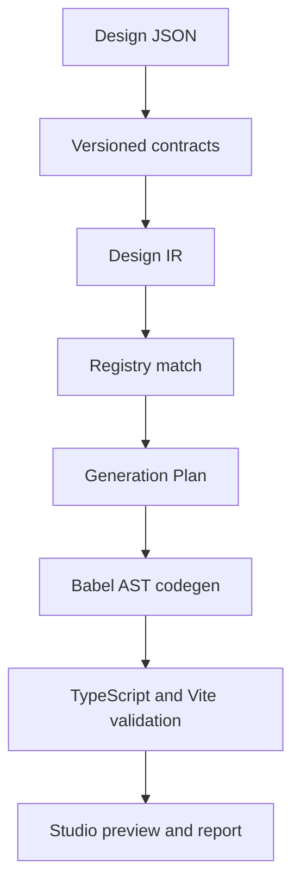

# ForgeUI

ForgeUI is a design-system-aware Design-to-Code workbench for enterprise marketing pages. It turns
versioned Design JSON into a normalized Design IR, maps real registered React components, builds a
deterministic generation plan, and emits React + TypeScript + CSS Variables + CSS Modules.

The project deliberately optimizes for trust rather than impressive-looking guesses: unsupported or
incompatible inputs become explainable diagnostics or manual review instead of silently generated code.

## Current status

The repository currently targets the Phase 1 vertical slice defined by the PRD and technical design:

- versioned input, IR, Registry, Generation Plan, manifest, and report contracts;
- AI SaaS flagship preset;
- stable Design IR normalization and duplicate-ID protection;
- minimal external component package and Registry exact matching;
- deterministic Generation Plan and Babel AST TSX generation;
- localhost Fastify Engine with health, analyze, and generate endpoints;
- React Studio for running and inspecting the flagship pipeline;
- repeatable tests, type checking, workspace builds, and a real Vite build of generated output.
- fixed valid/degraded/invalid evaluations and a pinned GitHub Actions quality gate.

Token conflict resolution, semantic scoring, AI Patch, version history, sandboxed preview, ZIP export,
Playwright layout assertions, and visual baselines remain later roadmap phases. They are not claimed as
implemented behavior.

## Why this architecture



Rules own deterministic and safety-critical work. AI is reserved for semantic suggestions and bounded,
versioned patches; it never owns imports, executable code, validation, or commits.

## Quick start

Requirements:

- Node.js 24 (the CI target will be pinned as the project matures)
- pnpm 11

```bash
pnpm install
pnpm dev
```

The Engine listens on `127.0.0.1:4000`. The Studio opens on `http://localhost:5173` and proxies
`/api` requests to the Engine.

Run the complete local gate:

```bash
pnpm check
```

Run test layers independently or generate coverage:

```bash
pnpm test:unit
pnpm test:api
pnpm test:ui
pnpm test:coverage
pnpm evals
```

See the [test strategy](./docs/testing/TEST-STRATEGY.md),
[traceable test cases](./docs/testing/TEST-CASES.md), and
[latest execution report](./docs/testing/TEST-REPORT.md). Browser screenshot and layout baselines
remain an explicit Phase 4 gate and are not counted as passed in Phase 1.

The [batch execution plan](./docs/batches/README.md) defines the stacked branch order, task IDs,
test cases, and acceptance gate for every remaining MVP increment.

Or run checks separately:

```bash
pnpm typecheck
pnpm test
pnpm build
pnpm validate:flagship
```

`pnpm validate:flagship` materializes the generated AI SaaS page in an exact local output directory,
runs a real Vite production build, reports the result, and removes only that known output directory.

## Repository layout

```text
apps/
  studio/                  React workbench
  engine/                  Local Fastify generation engine
packages/
  contracts/               Versioned Zod schemas and API contracts
  design-ir/               Deterministic input normalization
  component-registry/      Manifest validation and exact matching
  generation-plan/         Stable page/file/import plan
  code-generator/          Babel AST TSX and project generation
  example-external-ui/     Independent registered React components
presets/saas/              Flagship input and Registry manifest
evals/flagship-saas/       Fixed expected outcomes
scripts/                   Reproducible generation/validation commands
.ai/                       AI development constraints and review rules
docs/architecture-decisions/
```

## Engine API

| Method | Path            | Phase 1 behavior                                                |
| ------ | --------------- | --------------------------------------------------------------- |
| `GET`  | `/api/health`   | Returns Engine and schema versions                              |
| `POST` | `/api/analyze`  | Validates input/Registry, builds IR, and returns exact matches  |
| `POST` | `/api/generate` | Runs analyze -> plan -> AST generation and returns files/report |

Future API paths in the technical design are added only when their validation and failure behavior exist.

## Trust and safety boundaries

- Input bytes, node count, depth, text length, schema, and duplicate IDs are validated before generation.
- Registry imports must stay inside declared allowlisted roots.
- Design copy, node names, metadata, manifests, and future AI output are treated as untrusted data.
- User scripts, arbitrary dependencies, lifecycle scripts, and dynamic imports are never executed.
- Model credentials belong only to the local Engine environment.
- Unknown component capability degrades to a diagnostic/manual-review path; it is not guessed.

See [AGENTS.md](./AGENTS.md) for contributor rules and architecture boundaries.

## Determinism

Generated source is stable for the same input, schema, Registry, Engine, and generator versions. Source
files do not contain timestamps, random IDs, machine paths, or environment-specific data. `createdAt`
is isolated to the manifest boundary and excluded from deterministic source comparisons.

## Roadmap

| Phase | Outcome                                                                       |
| ----- | ----------------------------------------------------------------------------- |
| 1     | Contract -> IR -> exact match -> plan -> AST -> real build                    |
| 2     | Tokens, hard constraints, adapters/recipes, semantic matcher, diagnostics     |
| 3     | Three-panel Studio, linked tree/preview/code, responsive resolver             |
| 4     | full validator, isolated preview, Playwright, visual checks, ZIP export       |
| 5     | bounded AI Patch, version guard, immutable apply, rollback, IndexedDB history |
| 6     | fixed valid/degraded/invalid eval suite, CI reports, demo assets              |

## Evidence and limitations

ForgeUI does not publish invented productivity or accuracy numbers. Any future component accuracy,
build pass rate, patch success rate, timing, accessibility, or visual-regression claim must be reproduced
from committed eval cases in a fixed environment.

Known Phase 1 limitations:

- only the AI SaaS preset and exact Source Key matching are complete;
- only the Hero vertical slice is generated;
- no untrusted package installation or browser execution sandbox exists yet;
- no screenshot-to-code or arbitrary Figma import exists;
- validation covers schemas, types, tests, workspace builds, and generated Vite output, not visual fidelity.

## Source documents

- [Product requirements](<./ForgeUI-产品文档-评审修订版(1).md>)
- [Technical design](<./ForgeUI-技术设计文档-评审修订版(1).md>)

These reviewed documents define the full MVP. This README distinguishes the implemented phase from the
longer-term target so the repository stays honest and interview-ready.
